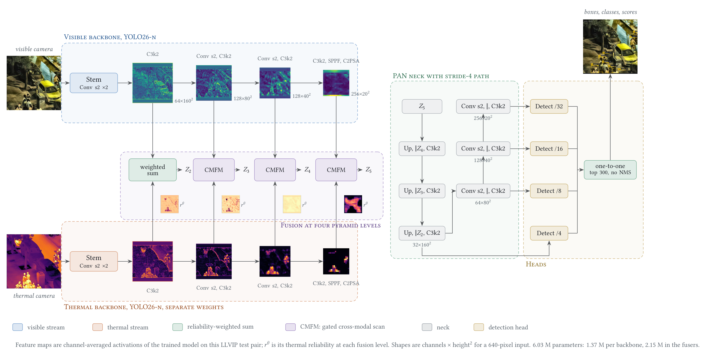
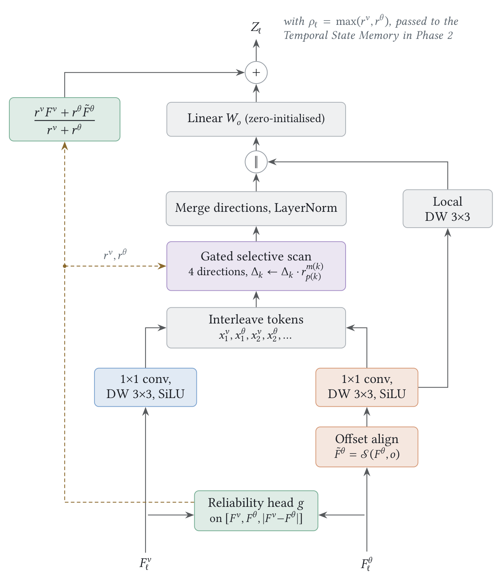
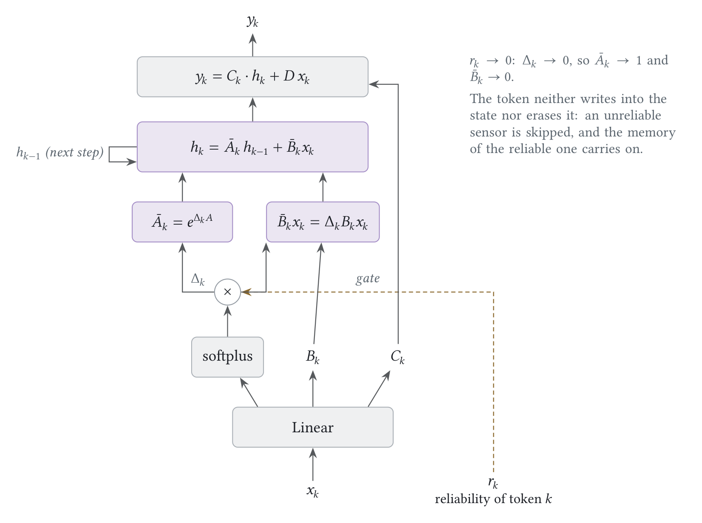
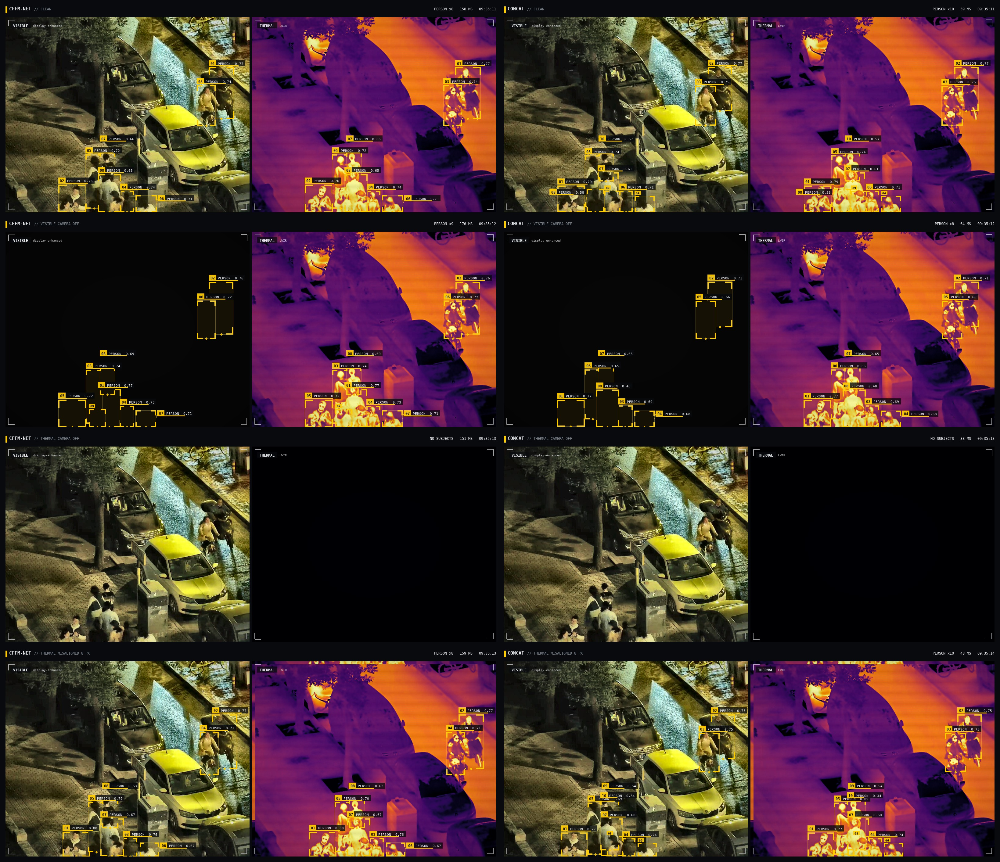
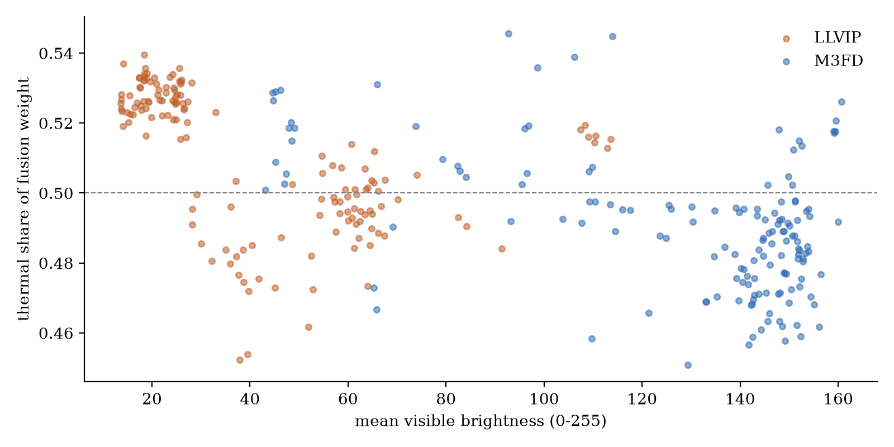
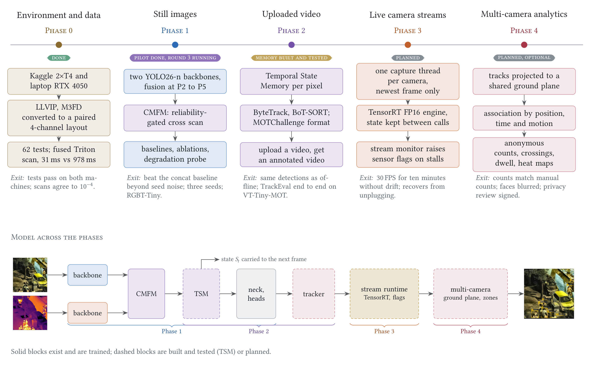

<h1 align="center">CFFM-Net</h1>

<p align="center"><b>Reliability-gated selective state-space fusion of visible and thermal cameras for small-object detection</b></p>

<p align="center">Ritesh Roshan</p>

<p align="center">
<a href="docs/atlas/CFFM-Net_Architecture_Atlas.pdf">Architecture atlas</a> &nbsp;·&nbsp;
<a href="docs/dossier/CFFM-Net_Research_Dossier.pdf">Research dossier</a> &nbsp;·&nbsp;
<a href="docs/novelty/CFFM-Net_Pilot_Novelty.pdf">Novelty note</a> &nbsp;·&nbsp;
<a href="cffm-net-pilot/results/tables.md">Result tables</a> &nbsp;·&nbsp;
<a href="cffm-net-pilot/notebooks">Notebooks</a> &nbsp;·&nbsp;
<a href="study-prep">Study path</a>
</p>


A thermal camera sees people in the dark. A visible camera sees texture, colour and print. Each one fails where
the other does not: glare, fog, a lens that drifts out of registration, a sensor that drops out. Most fusion
networks merge the two streams with weights that are fixed once training ends, so a failing camera keeps writing
into the fused representation.

CFFM-Net makes reliability part of the computation. Two YOLO26 backbones are fused at four pyramid levels by a
Mamba-style selective scan over **interleaved visible and thermal tokens**, and the discretisation step of every
token is **multiplied by a learned per-pixel estimate of how reliable its camera is at that location**. A selective
scan with step zero neither writes to nor erases its state, so the tokens of an unreliable camera are skipped. When a
camera is flagged as down, the skip is exact, because it follows from the algebra and not from what the network learned.

This repository contains the complete pilot:
- the model, and a fused Triton kernel for the gated scan;
- 78 tests;
- five hypotheses whose decision rules were written before any training;
- 14 training runs on LLVIP and M3FD (one run is excluded, explained below);
- a sensor-fault probe;
- a tracking and analysis showcase;
- a deployable demo;
- every figure, kept as TikZ source.

## At a glance

| result | what it means |
|---|---|
| **+5.6 AP** | from the reliability gate alone when the visible image is darkened at test time (0.599 vs 0.542, same network without the gate) |
| **+2.9 AP** | over the concat baseline when the thermal camera is misregistered by 8 px (0.326 vs 0.297) |
| **0.174 vs 0.003** | AP with the thermal camera removed and flagged, against concat, which has no way to be told |
| **31×** | faster gated scan with the fused Triton kernel (forward and backward, 31 ms vs 978 ms on a T4); training step 2.47 s → 0.285 s |
| **1.79×** | the latency of the concat baseline (41.9 vs 23.4 ms, T4, FP16, batch 1), inside the pre-registered budget of 2× |
| **not yet** | better on clean images: 0.629 vs 0.650 AP on LLVIP; 0.488 vs 0.482 on M3FD under matched training, within noise |

The last row matters as much as the others. The pilot shows that the mechanism works where it was designed to work,
under sensor faults. It does not yet show a clean-accuracy gain. Longer training runs are in progress (see
[Status](#status)).

## Method

<p align="center"></p>

<p align="center"><sub>CFFM-Net as trained, drawn with the real activations of one LLVIP test pair. Each camera has its own
YOLO26-n backbone. The two streams never mix inside the backbones. They meet only in the fusion blocks at P2
(a reliability-weighted sum) and at P3–P5 (CMFM). The small maps are the thermal reliability r<sup>θ</sup> the
model assigned at each level. 6.03 M parameters, 18.4 GFLOPs at 640 px.</sub></p>

**Reliability.** At each fusion level ℓ, a light head reads both feature maps and their disagreement and outputs one
trust map per camera:

$$\big(r^{v}, r^{\theta}\big) = \sigma\Big(g\big([F^{v},\, F^{\theta},\, |F^{v}-F^{\theta}|]\big)\Big)\odot s,$$

where $s\in\lbrace 0,1\rbrace^{2}$ are optional sensor-health flags. Nothing supervises $r$ directly. It is learned
only through the detection loss.

**Gated cross-scan.** The thermal map is warped onto the visible one by a learned offset of at most four cells. Both
are projected to $d=c/2$ channels and interleaved location by location,
$x^{v}_{1}, x^{\theta}_{1}, x^{v}_{2}, x^{\theta}_{2}, \dots$, giving $L = 2HW$ tokens. Each token's step is then
scaled by the reliability of the camera that produced it:

$$\Delta_k = r_k\cdot\operatorname{softplus}\big(W_{\Delta}x_k + b_{\Delta}\big),\qquad
h_k = e^{\Delta_k A}\,h_{k-1} + \Delta_k B_k\,x_k,\qquad y_k = C_k h_k + D\,x_k .$$

The scan runs in four directions (rows and columns, each forwards and backwards), as in VMamba's SS2D, and the
directions are summed back on the grid.

**Residual form.** The block output is the reliability-weighted mean of its inputs plus a learned correction:

$$Z = \frac{r^{v}F^{v} + r^{\theta}\tilde F^{\theta}}{\max\big(r^{v}+r^{\theta},\,10^{-2}\big)}
\;+\; W_o\Big[\operatorname{LN}\big(\mathrm{scan}_r(\cdot)\big),\ \operatorname{DWConv}(\cdot)\Big],
\qquad W_o \leftarrow 0 .$$

<p align="center">

&nbsp;&nbsp;

</p>

### Two properties that hold by construction, and are tested

1. **A camera with zero reliability cannot write to the state.** If $r_k = 0$, then $e^{\Delta_k A} = I$ and
   $\Delta_k B_k x_k = 0$, so token $k$ leaves $h$ unchanged. The tests set $r^{\theta} = 0$, perturb the thermal
   features, and check that the visible outputs of the scan do not move.
2. **A new block is exactly a reliability-weighted average.** $W_o$ starts at zero and the offset field starts at
   the identity, so training starts from a well-defined fusion and can only add to it. COCO-pretrained backbones go
   in without disturbance.

Both properties are checked in [`tests/`](cffm-net-pilot/tests). The 78 tests there also cover:
- equivalence of the two-pass PyTorch scan, the fused Triton kernel and the textbook recurrence, in values and gradients;
- direction ordering;
- the converters;
- the run plan;
- the pre-registered decision rules.

## Results

All numbers are COCO AP50-95. LLVIP is evaluated on its full official test set of 3,463 pairs and trained on every
third frame of its train set, because consecutive frames are near duplicates. M3FD has no official split, so it
uses a seeded 80/20 split (seed 0). Every run uses one seed, YOLO26-n backbones, 30 epochs, a 640 px input and
COCO-pretrained weights, with 2 × T4.

### Clean accuracy

| model | params | GFLOPs | T4 ms | LLVIP AP | AP50 | M3FD AP | AP50 |
|---|---:|---:|---:|---:|---:|---:|---:|
| YOLO26-n, visible only | 2.50 M | 5.9 | 17.2 | 0.520 | 0.900 | | |
| YOLO26-n, thermal only | 2.50 M | 5.9 | 17.0 | 0.641 | 0.962 | | |
| two-stream concat | 4.07 M | 9.7 | 23.4 | 0.650 | 0.968 | **0.505** | **0.782** |
| CFFM-Net, pilot (stride-4 head) | 6.03 M | 18.4 | 41.9 | 0.629 | 0.958 | 0.479 | 0.773 |
| *round 2, both trained with modality dropout* | | | | | | | |
| two-stream concat + dropout | 4.07 M | 9.7 | 23.4 | **0.652** | **0.969** | 0.482 | 0.760 |
| CFFM-Net v2 + dropout | 6.02 M | 16.5 | | rerun | | 0.488 | 0.758 |

The LLVIP v2 run of round 2 is excluded. It diverged in FP16 before the fix described under
[engineering](#engineering), and it is being rerun in round 3. Modality dropout blacks out one camera with probability 0.15
each and tells the model in half of those cases. On M3FD it costs the concat baseline 2.2 AP on clean images.

**Head control.** The pilot used YOLO26's stride-4 head. A 2 × 2 control separates the head from the fusion:

| LLVIP AP | concat | CFFM-Net | gap |
|---|---:|---:|---:|
| stride-4 head (P2–P5) | 0.632 | 0.629 | −0.3 |
| standard head (P3–P5) | 0.650 | 0.635 | −1.5 |

The stride-4 head costs concat 1.8 AP and CFFM-Net 0.6, which is within noise. Matching the head explains most of
the pilot's deficit at stride 4, but not with the standard head. v2 returns to the standard head.

### Under sensor faults

The same LLVIP test set, with one fault applied at test time. "Flagged" means the model is told which camera is gone.

| fault | concat | CFFM-Net, no gate | CFFM-Net |
|---|---:|---:|---:|
| none | **0.650** | 0.626 | 0.629 |
| visible darkened | **0.610** | 0.542 | 0.599 |
| visible removed | **0.618** | 0.570 | 0.567 |
| visible removed, flagged | **0.618** | 0.570 | 0.595 |
| thermal removed | 0.003 | 0.007 | **0.022** |
| thermal removed, flagged | 0.003 | 0.007 | **0.174** |
| thermal misregistered 4 px | 0.516 | 0.518 | **0.533** |
| thermal misregistered 8 px | 0.297 | 0.311 | **0.326** |
| thermal misregistered 16 px | 0.017 | **0.029** | 0.028 |

Four readings:
- **The gate is what absorbs a degraded camera.** Removing it costs 5.6 AP under darkening and nothing on clean images.
- **The offset alignment helps within the misregistration it was trained on.** CFFM-Net gains +1.7 and +2.9 AP at
  4 and 8 px. At 16 px every model collapses, because that shift is far outside anything in the training data,
  where the 99th percentile is 4.7 px.
- **The flag path works.** With thermal removed and flagged, CFFM-Net keeps 0.174 AP on a night dataset, from the
  visible camera alone.
- **Losing the visible camera hurts CFFM-Net more than concat.** The drop is 6.2 points against 3.1 unflagged. With
  the flag, it is 3.4 against 3.1.

No pilot model saw a missing camera in training. Round 2 adds that, and its probe is next.

<p align="center"></p>

<p align="center"><sub>Left: CFFM-Net. Right: concat. Rows from top: clean, visible camera off, thermal camera off,
thermal misregistered by 8 px.</sub></p>

### What the gate learned

<p align="center"></p>

Nothing tells the reliability head what darkness is. Even so, the thermal share of the fusion weight is highest in
the darkest LLVIP scenes, about 0.53, and lowest in bright daytime M3FD scenes, about 0.47. The effect is consistent
and small. On clean, well-registered data the learned gate stays soft. The probe above shows where it becomes decisive.

### Pre-registered hypotheses

The decision rules were written before training. A difference under 1.5 AP points (1.0 for PH4) counts as
inconclusive.

| | hypothesis | evidence | verdict |
|---|---|---|---|
| PH1 | fusion beats the best single camera at night | −1.2 AP vs thermal-only | inconclusive |
| PH2 | gating the step adds value | +0.3 clean; +1.3 less degradation on average | inconclusive |
| PH3 | the fusion helps 8–32 px objects (M3FD) | −2.5 AP vs concat in the 8–32 px bands | against |
| PH4 | the selective scan is needed | +0.1 AP vs a FLOP-matched gated-conv control | inconclusive |
| PH5 | latency at most 2× the two-stream baseline | 1.79× | supported |

One hypothesis is supported, one is contradicted and three are inconclusive. With one seed per configuration, the
pilot can support or undermine a hypothesis but cannot establish it. The full study uses three seeds.

## Engineering

**A fused kernel for the gated scan.** At stride 8, the scan runs over 12,800 interleaved tokens per direction. The
two-pass chunked PyTorch scan is exact but memory-bound. [`scan.py`](cffm-net-pilot/src/cffm/scan.py) adds a Triton
kernel for the forward and backward passes, which holds the state in registers. On a T4 it takes 31 ms against
978 ms, and one CFFM-Net training step drops from 2.47 s to 0.285 s. When `mamba_ssm` is present it is used, then
Triton, then PyTorch. All three agree with the textbook loop in values and gradients.

**Numerics.** A recurrence over twelve thousand tokens overflows FP16. The whole scan path therefore runs in FP32
under AMP: projections, steps, state and the fusion weights. The weighted mean is computed in FP32 with its
denominator floored at $10^{-2}$. Before that floor, modality dropout could drive both reliabilities near zero and
produce a NaN, which is what invalidated the round-2 LLVIP run.

**FLOP accounting.** Standard profilers do not count the element-wise work of a selective scan. The reported
GFLOPs add about 11 FLOPs per token, channel and state for the two passes. The gated-conv control of PH4 is matched
to CFFM-Net on this full count: 18.30 against 18.39 GFLOPs.

**Data audit.** On LLVIP, 55% of frames are dark (mean below 50 of 255) and the median person is 71 px. On M3FD,
32% of objects are under 16 px and 59% are under 32 px. The 99th-percentile misregistration between the two cameras
is 4.7 px on LLVIP and 7.8 px on M3FD. These numbers set the range of the offset warp and the choice of size bands.

## Reproduce

```bash
git clone https://github.com/riteshroshann/yolo-cross-feature-fusion-mamba-net
cd yolo-cross-feature-fusion-mamba-net/cffm-net-pilot
pip install torch torchvision --index-url https://download.pytorch.org/whl/cu126
pip install -e ".[dev]"
python -m pytest -q
python tools/run_notebooks.py
```

Every run, with its dataset, model, batch size and schedule, is declared in
[`configs/pilot.yaml`](cffm-net-pilot/configs/pilot.yaml). The notebooks are generated from one script,
[`tools/build_notebooks.py`](cffm-net-pilot/tools/build_notebooks.py), and can be pushed to Kaggle and watched from
the command line:

```bash
python tools/make_zip.py
python tools/kaggle_run.py upload
python tools/kaggle_run.py push 07
python tools/kaggle_run.py wait 07
```

An interrupted run resumes from its last checkpoint. Runs that already finished are reused, not retrained. The
full walkthrough is in [`cffm-net-pilot/README.md`](cffm-net-pilot/README.md).

**Demo.** `python cffm-net-pilot/demo/app.py` starts a Gradio app. Upload a visible and thermal pair, or any photo,
and get the analysis board: numbered subjects, per-camera panels and the trust map. [`web/`](cffm-net-pilot/web)
is a static front-end for the same API.

<p align="center"></p>

<p align="center"><sub>The Phase 2 tracking pipeline on MOT17-04: YOLO26-n (COCO, visible only) with ByteTrack. It is a
preview of the video stack that CFFM-Net and the Temporal State Memory will run in, not a CFFM-Net result.</sub></p>

## Status

| phase | | state |
|---|---|---|
| 0 | environment, data, audit | done |
| 1 | still images: pilot, ablations, head control, round 2 | done |
| 1 | round 3: 80 epochs, both datasets, v2 and concat with dropout | training |
| 1 | full study: three seeds, YOLO26-s, RGBT-Tiny | planned |
| 2 | video: Temporal State Memory (built and tested), tracking | next |
| 3 | live cameras: capture threads, optimised engine, sensor monitor | planned |
| 4 | multiple cameras on one ground plane, anonymous counts only | optional |

<p align="center"></p>

## Repository

```
cffm-net-pilot/          the code, notebooks, configs, tests, results, demo and web front-end
  src/cffm/              scan.py, blocks.py, model.py, data.py, train.py, tsm.py, hud.py
  configs/               pilot.yaml (every run) and models/ (CFFM-Net, ablations, baselines)
  notebooks/             phase 0 (setup, data) and phase 1 (baselines to showcase), executed
  results/               tables, hypothesis verdicts, probe, figures, showcase boards
  docs/figures/          every diagram, as TikZ source
docs/atlas/              Architecture Atlas: YOLOv1 to YOLO26, SSMs to VMamba, CFFM-Net, scope
docs/dossier/            research dossier: survey, method, evaluation plan
docs/novelty/            what the pilot adds over prior visible-thermal fusion
docs/datasets/           datasets, licences and how to obtain them
study-prep/              learning path, lecture links, 37 papers by stage, study guide
papers/                  the open-access papers the dossier cites
```

## Citation

```bibtex
@misc{roshan2026cffmnet,
  title        = {{CFFM-Net}: Reliability-Gated Selective State-Space Fusion of Visible and Thermal Cameras
                  for Small-Object Detection},
  author       = {Roshan, Ritesh},
  year         = {2026},
  howpublished = {\url{https://github.com/riteshroshann/yolo-cross-feature-fusion-mamba-net}}
}
```

## Acknowledgements

This work builds on these projects and datasets:
- [Ultralytics YOLO26](https://github.com/ultralytics/ultralytics);
- [Mamba](https://github.com/state-spaces/mamba) and [VMamba](https://github.com/MzeroMiko/VMamba);
- [ByteTrack](https://github.com/ifzhang/ByteTrack);
- [LLVIP](https://bupt-ai-cz.github.io/LLVIP/), [M3FD](https://github.com/JinyuanLiu-CV/TarDAL) and
  [MOT17](https://motchallenge.net/data/MOT17/).

Compute came from Kaggle's free T4 GPUs and one laptop RTX 4050.
