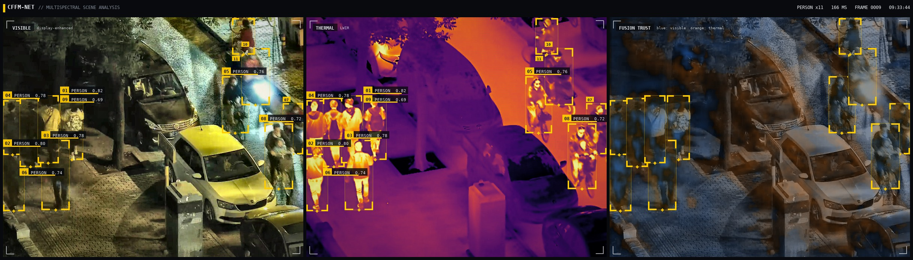
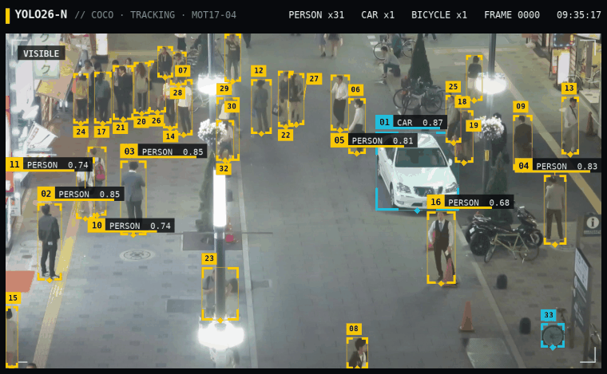

# cffm-net



Object detection from a visible and a thermal camera at once. Two YOLO26 backbones, fused by a Mamba-style
selective scan whose step size is scaled by how reliable each camera is at each location.

| AP50-95 | LLVIP | M3FD |
|---|---|---|
| thermal only | 0.641 | |
| concat | 0.650 | 0.505 |
| CFFM-Net, pilot | 0.629 | 0.479 |

The pilot trails concat on clean images but holds up better when the thermal camera drifts or drops out.
Round 2 (standard head, modality dropout) is training.



```
cffm-net-pilot/   code, notebooks, results, demo app and web front-end
docs/dossier/     research dossier: survey, method, plan
docs/novelty/     what the pilot adds, and the limitations of prior work it targets
docs/datasets/    which datasets, and how to get them
papers/           the open-access papers the dossier cites
```

Demo: `python cffm-net-pilot/demo/app.py`. Everything else: `cffm-net-pilot/README.md`.
